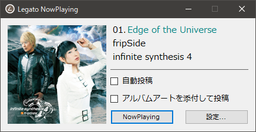

# Legato-NowPlaying(en)
A NowPlaying Application for Twitter with AIMP Remote API library "Legato".

Let's share on Twitter for your track information!

## License for Legato-NowPlaying itself
MIT License

### Libraries used in Legato-NowPlaying, and its licenses
- Legato : MIT License
- AlbumArtExtraction : MIT License
- CoreTweet : MIT License
- Json.NET(Newtonsoft.Json) : MIT License

----
----

# Legato-NowPlaying(ja)
AIMP Remote API ライブラリ「Legato」を利用したTwitter向けNowPlayingアプリケーションです。

あなたの聴いている曲を Twitter で共有しよう！

## Legato-NowPlaying自体のライセンス
MIT ライセンス

### Legato-NowPlayingで利用しているライブラリとそのライセンス
- Legato : MIT ライセンス
- AlbumArtExtraction : MIT ライセンス
- CoreTweet : MIT ライセンス
- Json.NET(Newtonsoft.Json) : MIT ライセンス
